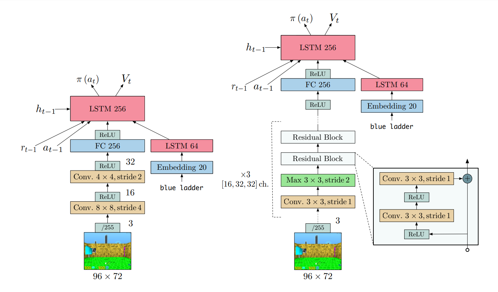

# 目录

# 模型名称IMPALA

IMPALA是一种强化学习算法。
[论文](https://arxiv.org/abs/1802.01561)：IMPALA: Scalable Distributed Deep-RL with Importance Weighted Actor-Learner Architectures
这是基于XingTian（刑天）框架以及Mindspore（昇思）框架实现的IMPALA算法

刑天 (XingTian) 是一个组件化强化学习库，用于开发、验证强化学习算法。它目前已支持包括DQN、DDPG、PPO和IMPALA等系列算法，可以在多种环境中训练智能体，如Gym、Atari、Torcs、StarCraftII等。 为了满足用户快速验证和解决RL问题的需求，刑天抽象出了四个模块：`Algorithm`,`Model`,`Agent`,`Environment`。它们的工作方式类似于"乐高"积木的组合。

## 模型架构

IMPALA模型的灵感源于广受欢迎的A3C架构，后者使用多个分布式actor来学习agent的参数。在这种类似的模型中，每个actor都使用策略参数的一个副本，在环境中进行操作。actor会周期性地暂停探索，并将它们已经计算出的梯度信息共享给中央参数服务器，该服务器会对参数进行更新。然而，与A3C不同，IMPALA中的actor不会被用来计算梯度信息，它们只是收集经验，并将这些经验传递至位于中心的learner，learner负责计算梯度。在这种模型中，actor和learner是完全独立的。

由于actor仅用于环境采样，而该任务通常是在仿真环境中进行的，因此actor和learner在计算重点上存在显著差异，所以actor和learner的软硬件可以采用异构设计。此外，由于actor无须计算梯度，它可以持续进行采样，而无需等待策略的更新，这也是它与Batched A2C的最大区别。然而，actor与learner的解耦也导致actor的策略落后于learner。为了弥补其中的差距，IMPALA还引入了V-trace技术。



更多细节可以参考[原论文](https://arxiv.org/abs/1802.01561)。

## 数据集

IMPALA作为一种强化学习算法，模型通过和环境交互收集样本更新参数权重。我们在gym上训练智能体。Gym是一个最广泛使用的强化学习实验环境，内置上百种实验环境，比如一些简单几何体的运动，一些用文本表示的简单游戏，或者机械臂的抓取和控制等实验环境。IMPALA模型在XingTian框架的游戏beamrider、breakout、cartpole、pong、qbert、spaceinvader等环境下进行强化学习训练。通过智能体与环境交互获得状态动作、奖励、下一状态，并将这些值代入神经网络训练，以获得理想结果。

## 环境要求

* 硬件（GPU or NPU）
    * 使用GPU处理器或者NPU处理器来搭建硬件环境。
    
* 框架
    * MindSpore(1.8.0)，参考MindSpore-1.8.0版本的[安装教程](https://www.mindspore.cn/versions#1.8.0)
    * XingTian(0.3.0)，参考XingTian的[安装教程](https://github.com/huawei-noah/xingtian)
    
* 其他第三方库参考`requirements.txt`

* 在训练或推理前额外的操作

    由于版本迭代，`requirements.txt`中的部分模块在默认安装最新版后将与其它组件产生兼容性问题，此时需要降低相关模块的版本，如下所示。

    ```
    pip install -U pyarrow==6.0.1
    pip install gym-minigrid==1.0.0
    pip install gym==0.19.0
    ```

## 快速入门

完成框架安装和环境配之后，你可以按照如下步骤进行模型的训练和评估

```
cd xingtian
# 训练
xt_main -f examples/<game-name>_impala_ms.yaml -t train
# 训练和评估
xt_main -f examples/<game-name>_impala_ms.yaml -t train_with_evaluate
```

## 脚本说明

### 脚本和样例代码

```bash
/xingtian/xt/model/impala/
├── __init__.py
├── default_config.py # 参数配置
├── impala_cnn_ms.py # Mindspore实现采用卷积神经网络的impala算法
├── impala_cnn.py
├── impala_cnn_opt_ms.py # Mindspore实现采用带优化器的卷积神经网络的impala算法
├── impala_cnn_opt.py
├── impala_cnn_zeus.py
├── impala_cnn.py
├── impala_mlp_ms.py # Mindspore实现采用多层感知机的impala算法
├── impala_mlp.py
├── impala_mlp_zeus.py
├── vtrace_ms.py # Mindspore实现的V-trace方法
└── vtrace.py
```

### 脚本参数

```python
LR = 0.0003 # 学习率
ENTROPY_LOSS = 0.01 # 熵损失
HIDDEN_SIZE = 128
NUM_LAYERS = 1
GAMMA = 0.99
```

## 训练过程

### 训练配置

下面是一个有关Impala算法的参数示例，我们通过配置系统中已注册的算法，环境信息来组合训练任务。有关不同参数更详细的描述可以在[用户指导](./docs/user.cn.md) 中找到。基于Mindspore实现的Impala算法训练配置脚本位于```examples/cartpole_impala_ms.yaml```中

```yaml
# examples/cartpole_impala_ms.yaml
alg_para:                           # 算法配置
  alg_name: IMPALA
  alg_config: {
    "train_per_checkpoint": 2,
    'prepare_times_per_train': 2,
    'BATCH_SIZE': 800,
    'episode_len': 200,
  }

env_para:                           # 环境配置
  env_name: GymEnv
  env_info: { 'name': CartPole-v0, 'vision': False}

agent_para:                         # agent配置
  agent_name: CartpoleImpala
  agent_num : 1
  agent_config: {
    'max_steps': 200,                  # agent最大步数
    'complete_step': 10000000,         # agent训练完成帧数
  }


model_para:
  actor:
    model_name: ImpalaMlpMS
    state_dim: [4]
    action_dim: 2

env_num: 10                         # 启动的环境数量
```
另外在 [examples](./examples) 目录下，可以找到更加丰富的训练配置示例。

### 训练

通过以下命令训练

```sh
xt_main -f examples/<game-name>_impala_ms.yaml -t train
```


### 训练和评估
通过以下命令训练和评估
```sh
xt_main -f examples/<game-name>_impala_ms.yaml -t train_with_evaluate
```


## 精度和性能

* 10M step 之后的IMPALA 收敛回报 (40M frames)
  
    | env      | IMPALA On Mindspore(NPU) | IMPALA On Mindspore(GPU) | IMPALA On Tensorflow |
    | -------- | ------------------------ | ------------------------ | -------------------- |
    | Cartpole | 124                      | 158                      | 200                  |


* 吞吐量(step per second)

    | env      | IMPALA On Mindspore(NPU) | IMPALA On Mindspore(GPU) | IMPALA On Tensorflow |
    | -------- | ------------------------ | ------------------------ | -------------------- |
    | Cartpole | 1559                      | 3143                      | 5072                 |


> 实验硬件环境: 
>
> TF     72  Intel(R) Xeon(R) Gold 6154 CPU @ 3.00GHz with single Tesla V100
>
> MS NPU 72  Intel(R) Xeon(R) Gold 6240 CPU @ 2.60GHz with single Ascend 910
>
> MS GPU 20 Intel(R) Xeon(R) Gold 6230 CPU @ 2.10GHz *2  with single RTX2080Ti